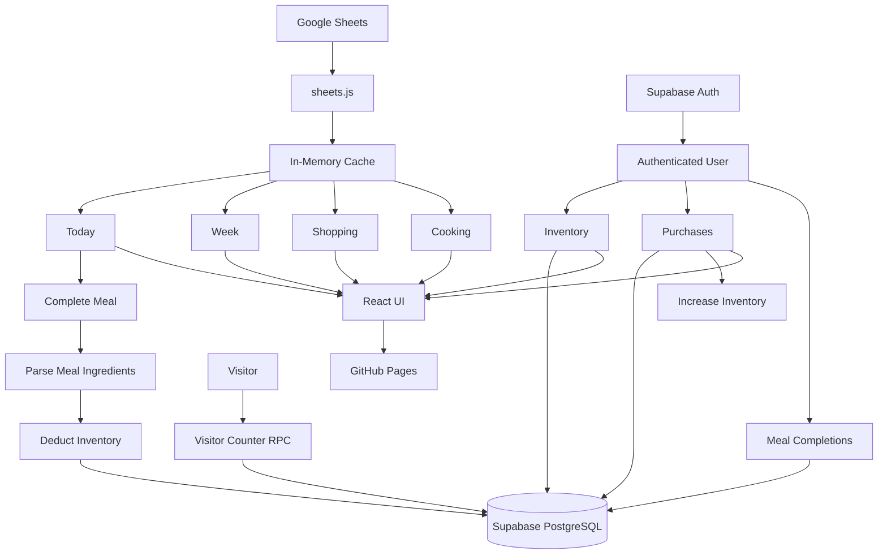
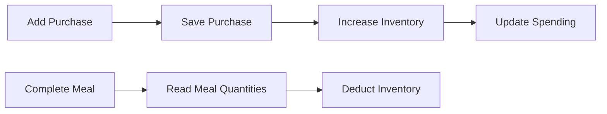
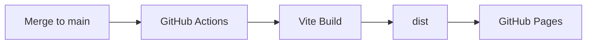

<div align="center">


### [ ▶ See Live Demo ](https://anjiladhikari.github.io/food_planner/)

# 🍽️ My Food Plan

**A personal meal planner for meals, groceries, inventory and spending.**
**A responsive meal-planning and food tracking app powered by Google Sheets and Supabase.**


<br>


</div>

---

## What is this?

A personal meal-planning web app built around a Google Sheet meal plan.

The public app provides **Today**, **Week**, **Shopping** and **Cooking**, while authenticated users can also track **Inventory**, **Purchases**, spending and completed meals.

---
## AI / RAG Assistant

The Food Planner now includes a grounded website chatbot. A floating **Ask** button on the live app answers meal-plan, shopping and cooking questions using only the site's public knowledge, cites the sources it used, and abstains when the website has no evidence.

It runs as a separate RAG (retrieval-augmented generation) service: Google Sheets → structured chunks → `BAAI/bge-small-en-v1.5` embeddings via Hugging Face → Supabase pgvector → FastAPI on Render → Groq for grounded generation. Private data such as inventory and purchases is intentionally not indexed.
## Features

| View | Purpose |
| --- | --- |
| 📅 **Today** | Daily meals, nutrition, previous/next day navigation and meal completion |
| 🗓️ **Week** | Compact multi-day weekly overview |
| 🛒 **Shopping** | Recommended products and Woolworths links |
| 🍳 **Cooking** | Equipment, preparation methods and tips |
| 📦 **Inventory** | Track food remaining at home |
| 💳 **Purchases** | Record groceries and track weekly, monthly, yearly and total spending |

Completing a meal automatically deducts its ingredients from inventory.

Adding a purchase automatically increases the matching inventory quantity.

---

## How it works

The app uses two data sources for different purposes:

- **Google Sheets** stores the relatively static meal-plan content.
- **Supabase PostgreSQL** stores changing and private user data such as inventory, purchases and meal completions.



### Meal-plan data

Meal, shopping and cooking information is maintained in Google Sheets.

The frontend:

```text
Google Sheets
      ↓
Google Visualization endpoint
      ↓
sheets.js
      ↓
In-memory cache
      ↓
React pages
```

Sheet data is cached in the browser so the same data does not need to be repeatedly fetched while using the app.

This keeps the meal plan easy to update — changing the Google Sheet does not require editing application code.

### Inventory and purchases

Inventory and purchase data changes frequently, so it is stored in Supabase instead of Google Sheets.

When a purchase is recorded:

```text
Select food + quantity + price
            ↓
      Save purchase
            ↓
    Increase inventory
            ↓
 Recalculate spending totals
```

The Purchases page calculates:

- This Week
- This Month
- This Year
- Total spending

from the user's stored purchase history.

### Meal completion

The Today page combines the static Google Sheet meal plan with live inventory data.

When a user completes a meal:

```text
Today's meal
     ↓
Read ingredient quantities
     ↓
Normalise food names
     ↓
Check tracked inventory
     ↓
Deduct matching quantities
     ↓
Save meal completion
```

For example:

```text
40g Rolled Oats  → Rolled Oats -40g
150ml Lite Milk  → Milk -150ml
1 Boiled Egg     → Eggs -1
1 Banana         → Banana -1
```

Foods that are not being tracked in inventory are simply ignored.

The meal-completion record prevents the same meal from deducting inventory twice.

### Authentication and privacy

Public meal-plan content does not require an account.

For private actions, the frontend uses Supabase Auth:

```text
Login
  ↓
Supabase Auth
  ↓
Authenticated user_id
  ↓
PostgreSQL Row Level Security
  ↓
Only that user's rows are returned
```

`inventory`, `purchases` and `meal_completions` are protected by Row Level Security, so privacy is enforced by the database rather than only by the React interface.

### Visitor counter

The footer uses small Supabase PostgreSQL functions to read and increment the visitor count.

```text
Page visit
    ↓
sessionStorage check
    ↓
Supabase RPC
    ↓
site_stats
    ↓
👁 Visitor count
```

A browser session is counted once rather than on every page/tab change.

### Deployment

The React frontend is deployed separately from the data services:

```text
GitHub
   ↓
GitHub Actions
   ↓
Vite production build
   ↓
GitHub Pages
   │
   ├── Google Sheets
   │      └── public meal data
   │
   └── Supabase Cloud
          ├── Auth
          ├── PostgreSQL
          └── RLS
```

Local development uses Docker-based local Supabase, while the deployed website connects to the production Supabase project.

### Data flow

1. Meal, shopping and cooking data stay in Google Sheets.
2. Sheet data is fetched and cached in memory by the frontend.
3. Private user data is stored in Supabase PostgreSQL.
4. Supabase Auth + Row Level Security keep each user's data private.
5. Purchases increase inventory automatically.
6. Completing a meal deducts the corresponding food quantities.

---

## Public & private access

Anyone can view:

```text
Today · Week · Shopping · Cooking
```

The Inventory and Purchases interfaces are also visible publicly, but private data and write actions require login.

```text
Add Inventory
Add Purchase
Update / Delete Inventory
Complete Meal
        ↓
      Login
```

Supabase Row Level Security ensures users can access only their own private records.

---

## Architecture

```text
src/
├── components/
│   ├── Navigation.jsx
│   ├── MealCard.jsx
│   ├── FoodSelect.jsx
│   ├── UnitSelect.jsx
│   └── Footer.jsx
├── pages/
│   ├── Today.jsx
│   ├── Week.jsx
│   ├── Shopping.jsx
│   ├── Cooking.jsx
│   ├── Inventory.jsx
│   ├── Purchases.jsx
│   └── Login.jsx
├── lib/
│   ├── sheets.js
│   ├── supabase.js
│   ├── auth.js
│   ├── inventory.js
│   ├── purchases.js
│   ├── meals.js
│   └── visitors.js
├── App.jsx
├── main.jsx
└── index.css

supabase/
└── migrations/
```

| Area | Role |
| --- | --- |
| `components/` | Reusable UI |
| `pages/` | Application views |
| `lib/` | Sheets, Supabase and data utilities |
| `supabase/` | PostgreSQL migrations |
| `App.jsx` | Navigation, auth state and application layout |

---

## Tech stack

| Layer | Choice |
| --- | --- |
| Frontend | React 19 |
| Build tool | Vite 7 |
| Styling | Tailwind CSS 4 |
| Meal data | Google Sheets |
| Database | PostgreSQL / Supabase |
| Authentication | Supabase Auth |
| Security | PostgreSQL Row Level Security |
| Hosting | GitHub Pages |
| CI/CD | GitHub Actions |

---

## Inventory & purchase flow



Inventory supports:

```text
g · ml · count
```

Food selection is restricted to foods already used by the meal planner to prevent inconsistent inventory names.

---

## Visitor counter

The footer includes a lightweight visitor counter powered by Supabase.

```text
👁 123 visits
```

A visit is counted once per browser session.

---

## Deployment



Every update merged into `main` is automatically built and deployed.

---

## Local development

```bash
npm install
npx supabase start
npm run dev
```

Production build:

```bash
npm run build
```

Local development uses local Supabase through Docker, while the deployed website connects to the production Supabase project.

---

<div align="center">

### [ ▶ View Live App ](https://anjiladhikari.github.io/food_planner/)

### [ 📖 Read the full RAG engineering documentation → ](./rag_backed/README.md)

</div>

---

<div align="center">

Built for making everyday meal planning simpler.

**[Geeky Anjil](https://anjiladhikari.com.np)** 🙌

</div>