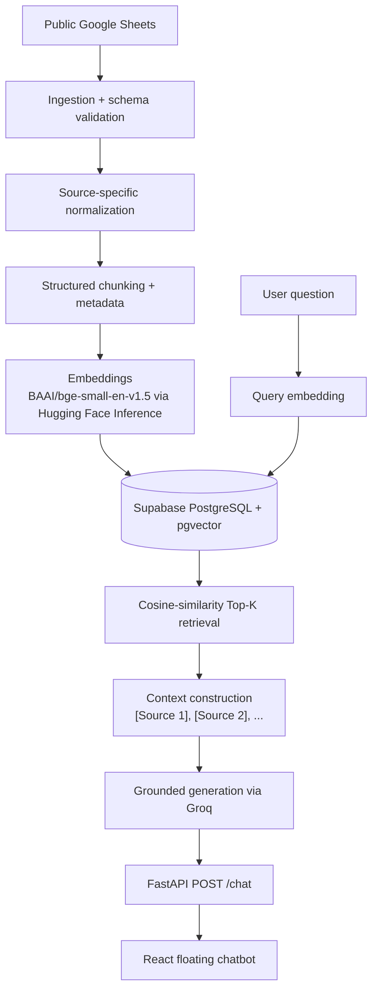

# Food Planner RAG Assistant

A website-grounded RAG (retrieval-augmented generation) assistant added to the existing [Food Planner](../README.md) application.

The assistant answers meal-plan, shopping and cooking questions using **only** the Food Planner's public knowledge. When the website does not contain enough evidence, it says so instead of guessing.

- **Live app:** https://anjiladhikari.github.io/food_planner/ (click **Ask** in the corner)
- **Backend health:** https://food-planner-iba3.onrender.com/health

---

## 1. Purpose

- Answer questions about the public meal plan, recommended shopping items and cooking instructions.
- Ground every answer in retrieved website content and cite the chunks used.
- Abstain with a fixed message when the retrieved evidence is insufficient.
- Leave the existing React application, Google Sheets data and Supabase user data untouched.

Private, authenticated Supabase data (inventory, purchases, meal completions) is **intentionally excluded** from the knowledge base.

---

## 2. Architecture



The embedding **model** and the inference **provider** are separate choices. The model is `BAAI/bge-small-en-v1.5`; it is served through the Hugging Face Inference API. Likewise the generator model is served through Groq.

| Concern | Choice |
| --- | --- |
| Knowledge source | Public Google Sheets tabs |
| Embedding model | `BAAI/bge-small-en-v1.5` (384 dimensions) |
| Embedding provider | Hugging Face Inference API (`huggingface_hub.InferenceClient`) |
| Vector store | Supabase PostgreSQL + pgvector (`rag_chunks` table) |
| Retrieval | Dense cosine-similarity Top-K (`match_rag_chunks` SQL function) |
| Generator model | `openai/gpt-oss-20b` |
| Generator provider | Groq API |
| Backend | FastAPI (`/health`, `/chat`) |
| Frontend | Existing React 19 / Vite app, one floating chat component |
| Backend hosting | Render |
| Frontend hosting | GitHub Pages |

---

## 3. Why Google Sheets instead of scraping HTML

The Food Planner frontend renders its public content from Google Sheets. Instead of scraping the rendered website, the RAG system reads the same structured sheet tabs directly:

| Sheet tab | Content |
| --- | --- |
| `food plan` | Day, breakfast, lunch, dinner, daily nutrition and cost |
| `cooking links and which food` | Food item, recommended product, reason, buying link |
| `how to cook` | Food item, equipment, method, pro tip |

Indexing the source data rather than the rendered page gives:

- cleaner structure with named columns,
- no navigation, button or layout noise,
- content closer to the source of truth,
- straightforward schema validation and metadata creation.

---

## 4. Knowledge boundary

| Indexed | Not indexed |
| --- | --- |
| Meal-plan knowledge (per day and meal) | Inventory |
| Shopping / product recommendations | Purchases |
| Cooking instructions | Meal completion state |
| | Authenticated user data |
| | Site visitor count |

Dynamic and private data changes per user and per minute. If a future version needs it, it should be queried live through the existing APIs or database access rather than embedded as static knowledge.

---

## 5. Ingestion

`ingest.py`

```text
Google Sheets (Visualization API, JSON)
   ↓ fetch_sheet()
Raw rows
   ↓ validate_sheet()        exact expected-column check per tab
   ↓ normalize_*()           source-specific records with named fields
Unified public knowledge   { food_plan, shopping, cooking }
```

Each tab's header row is compared against the expected column names. If a sheet is empty or its columns change, ingestion raises a `ValueError` naming the sheet and the expected versus actual header. Malformed data is never silently indexed.

---

## 6. Chunk design

`chunks.py`

The source rows are already meaningful semantic units, so chunking follows the data structure instead of splitting by an arbitrary token count.

| Source | Chunking rule | Chunks |
| --- | --- | --- |
| Food plan | One chunk per **day × section** (breakfast, lunch, dinner, nutrition/cost) | 28 |
| Shopping | One chunk per shopping row | 19 |
| Cooking | One chunk per cooking row | 11 |
| **Total** | | **58** |

Keeping each meal section separate means a question like "What is Day 2 lunch?" retrieves exactly that section rather than a whole day.

---

## 7. Chunk structure

Representative food-plan chunk (text shortened):

```json
{
  "id": "food_plan_day_1_breakfast",
  "text": "Day: Day 1\nSection: breakfast\n...",
  "metadata": {
    "source_type": "food_plan",
    "day": "Day 1",
    "section": "breakfast"
  }
}
```

Shopping and cooking chunks use ids `shopping_<n>` and `cooking_<n>` with `source_type` and `food_item` metadata.

| Field | Role |
| --- | --- |
| `id` | Stable chunk identity; used for upserts, citations and evaluation labels |
| `text` | The content that is embedded and retrieved |
| `metadata` | Structured source information shown in citations |

---

## 8. Embeddings and vector database

`embeddings.py`, `vector_store.py`

- Document chunks are embedded **once** during indexing.
- User queries are embedded **at query time**.
- Both use the same model, `BAAI/bge-small-en-v1.5`, producing 384-dimensional vectors.
- Queries are prefixed with the BGE retrieval instruction (`Represent this sentence for searching relevant passages: ...`) so query and passage embeddings are compared the way the model was trained.
- Vectors, original text and metadata are upserted into the `rag_chunks` table in Supabase PostgreSQL using pgvector.

Conceptual record:

```text
rag_chunks
├── id         text        (chunk id)
├── text       text        (chunk content)
├── metadata   jsonb
└── embedding  vector(384)
```

The `rag_chunks` table and the `match_rag_chunks` function were created in the Supabase project directly; they are not part of the `supabase/migrations/` folder in this repository.

---

## 9. Retrieval

`retrieval.py`

```text
User query
   ↓ embed_query()                   384-d vector
   ↓ match_rag_chunks(query_embedding, match_count)
Top-K chunks with chunk_id, content, metadata, similarity
```

The SQL function orders rows by pgvector cosine distance (`<=>`) and returns a similarity derived from it. The `/chat` pipeline uses **Top-3**.

The current baseline is intentionally **dense retrieval only**. No BM25, hybrid search, MMR, reranking or query rewriting was added, because the measured baseline below already performed strongly on the evaluation set. Those techniques remain options if a future evaluation shows a need.

---

## 10. Retrieval evaluation

`evaluation.py`

A small, manually labelled golden set of 7 queries maps each query to the chunk id(s) that should be retrieved. Retrieval is run at k = 3 and scored with Recall@3, Precision@3, Hit@3 and MRR.

| Metric | Result |
| --- | --- |
| Recall@3 | 1.00 |
| Precision@3 | 0.38 |
| Hit@3 | 1.00 |
| MRR | 1.00 |

**Reading Precision@3 correctly.** Six of the seven queries have exactly one relevant chunk, so retrieving it among three results yields Precision@3 = 1/3 for that query. One query has two relevant chunks (2/3). The mean is about 0.38, which is the ceiling for this labelling, not a sign of poor retrieval.

The most important observation was that the relevant chunk ranked **first** for every evaluation query (MRR = 1.00).

---

## 11. Grounded generation

`rag.py`

```text
Top-3 retrieved chunks
   ↓ build_context()      labelled as [Source 1], [Source 2], [Source 3]
   ↓ system prompt + question + context
   ↓ Groq chat completion (openai/gpt-oss-20b)
Answer with inline citations, or the abstention message
```

The system prompt instructs the model to:

- answer only from the supplied website context,
- not use outside knowledge, infer missing facts, expand abbreviations or add unsupported explanations,
- ignore retrieved sources that are unrelated to the question,
- cite supporting evidence as `[Source n]`,
- keep answers concise.

When the context is insufficient the model must reply exactly:

> I couldn't find that information in this website's knowledge.

No fine-tuning is involved. Grounding is achieved entirely through retrieval and prompt instructions.

---

## 12. Citation handling

Retrieved chunks are labelled `[Source 1]`, `[Source 2]`, `[Source 3]` in the prompt, and the model cites them with the same labels.

The API returns all retrieved candidates. The frontend then scans the answer text for `[Source n]` references and displays **only the sources the model actually cited**, so an unrelated retrieved chunk that the model ignored is not shown to the user.

---

## 13. Final-answer evaluation

`answer_evaluation.py`

The complete pipeline was run over a set of answerable and unanswerable questions and reviewed manually for:

- correctness,
- groundedness / faithfulness to the retrieved context,
- citation correctness,
- abstention on out-of-scope questions (for example, the weather or the capital of Japan).

**A failure found during evaluation.** The model expanded "EVOO" into an explanation that was not present in the website evidence. The grounding prompt was tightened to prohibit expanding abbreviations or adding unsupported explanations, and the evaluation was rerun successfully.

```text
build → evaluate → inspect failure → change one variable → rerun
```

---

## 14. API

`main.py` (FastAPI)

| Method | Path | Purpose |
| --- | --- | --- |
| `GET` | `/health` | Liveness check, returns `{"status": "ok"}` |
| `POST` | `/chat` | Answer one question with sources |

Request:

```json
{
  "question": "How do I cook rolled oats?"
}
```

Response shape (shortened):

```json
{
  "answer": "... [Source 1]",
  "sources": [
    {
      "chunk_id": "cooking_1",
      "metadata": { "source_type": "cooking", "food_item": "Rolled Oats" },
      "similarity": 0.74
    }
  ]
}
```

CORS is enabled for the local Vite dev server and the GitHub Pages origin.

---

## 15. Frontend

`src/components/RagChat.jsx`, mounted once in `src/App.jsx`, styled in `src/index.css`.

- The existing React application was preserved; no chat framework or new dependency was introduced.
- A floating **Ask** button opens a small panel.
- The question is sent to the FastAPI `/chat` endpoint.
- The generated answer appears in the panel, followed by the cited sources (food item or day, plus source type).
- If the backend cannot be reached, a short error message is shown instead.

---

## 16. Deployment

| Component | Where |
| --- | --- |
| Frontend | GitHub Pages (built by the existing GitHub Actions workflow) |
| Backend | Render (FastAPI + uvicorn) |
| Database / vector store | Supabase PostgreSQL + pgvector |
| Embeddings | Hugging Face Inference API |
| Generation | Groq API |

- Live app: https://anjiladhikari.github.io/food_planner/
- Backend health: https://food-planner-iba3.onrender.com/health

The backend runs on a Render free instance, which sleeps after inactivity. The first chatbot request after a quiet period can take noticeably longer while the service cold-starts.

---

## 17. Environment variables

The backend reads these variables (names only; never commit values):

| Variable | Used by |
| --- | --- |
| `HF_TOKEN` | Hugging Face Inference API (embeddings) |
| `SUPABASE_URL` | Supabase client |
| `SUPABASE_SECRET_KEY` | Supabase client (server-side key) |
| `GROQ_API_KEY` | Groq chat completions |

- Locally, values live in the repository-root `.env.local`, which is git-ignored and loaded with `python-dotenv`.
- On Render, the same names are set as environment variables in the service settings.
- Secrets must never be committed to Git.

---

## 18. Running locally

Python 3.12 and [uv](https://docs.astral.sh/uv/) are required for the backend. All backend scripts use flat imports, so run them from inside `rag_backed/`.

```bash
# Backend
cd rag_backed
uv sync

# One-off indexing: fetch sheets → chunk → embed → upsert into Supabase
uv run python vector_store.py

# Optional checks
uv run python ingest.py             # record counts per sheet
uv run python chunks.py             # chunk counts (58)
uv run python retrieval.py          # manual retrieval test
uv run python evaluation.py         # retrieval metrics
uv run python answer_evaluation.py  # end-to-end answers for manual review

# API server
uv run uvicorn main:app --reload    # http://127.0.0.1:8000
```

```bash
# Frontend (from the repository root)
npm install
npm run dev
```

The chat component calls the deployed Render backend URL directly. To test against a local API server, point the fetch URL in `src/components/RagChat.jsx` at `http://127.0.0.1:8000/chat` during development.

---

## 19. Important files

```text
rag_backed/
├── ingest.py             Fetch Google Sheets tabs, validate columns, normalize records
├── chunks.py             Build the 58 structured chunks with ids and metadata
├── embeddings.py         Hugging Face client, document and query embeddings
├── vector_store.py       Supabase client; run as a script to index all chunks
├── retrieval.py          Query embedding + Top-K cosine retrieval via match_rag_chunks
├── rag.py                Context construction and grounded Groq generation
├── main.py               FastAPI app exposing /health and /chat
├── evaluation.py         Golden retrieval set and Recall / Precision / Hit / MRR
├── answer_evaluation.py  End-to-end answer runs for manual review
├── pyproject.toml        Python dependencies (managed with uv)
├── uv.lock               Locked dependency versions
└── .python-version       3.12
```

Frontend integration:

- `src/components/RagChat.jsx` — floating chatbot component
- `src/App.jsx` — mounts `<RagChat />`
- `src/index.css` — `rag-chat-*` styles

---

## 20. Design decisions and lessons

- Index the true structured source instead of scraping rendered HTML when one exists.
- Establish and measure a dense baseline before adding hybrid retrieval, reranking or query rewriting.
- Evaluate retrieval separately from generation; they fail for different reasons.
- Vector search always returns nearest neighbours, even for irrelevant queries, so grounding instructions and an explicit abstention path matter.
- Deployment environments must declare every runtime dependency explicitly (a missing `numpy` broke embeddings on Render until it was added to `pyproject.toml`).
- Model and API provider are separate architectural choices; either can change independently.

---

## 21. Future improvements

- Automatic re-indexing when the public sheet data changes.
- Larger retrieval and final-answer evaluation sets.
- Reranking, only if a future evaluation demonstrates a need.
- Production hosting without cold starts.
- Live tool or API access for dynamic private data, where appropriate, instead of embedding it as static knowledge.
